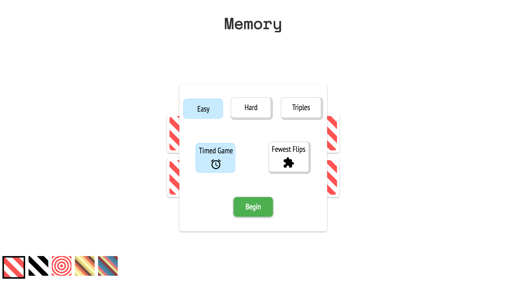

# Memory

##[Live](http://www.douglasgordon.me/Memory/)

A card-matching game featuring three difficulty levels, two game modes and your choice of card swatch. Built using React, HTML5 and Sass.

## Screenshot



## Code Snippet

Flipped-over (but not yet matched) cards are stored in an array. Every subsequent flip is checked against all these cards. As such, Memory can easily be scaled to handle data where cards come in sets of four, five, six or more.

```javascript
lastCardMatches(id) {
  let match = true
  this.state.lastMoveIds.forEach((moveId) => {
    if (this.state.cards[moveId].icon !== this.state.cards[id].icon) {
      match = false
    }
  })
  return match
}
```
